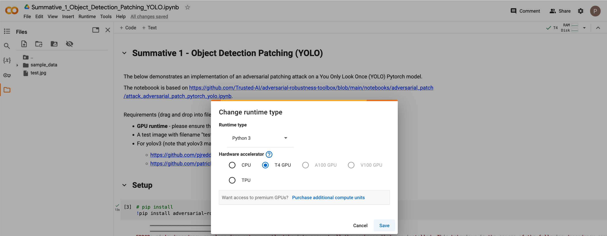
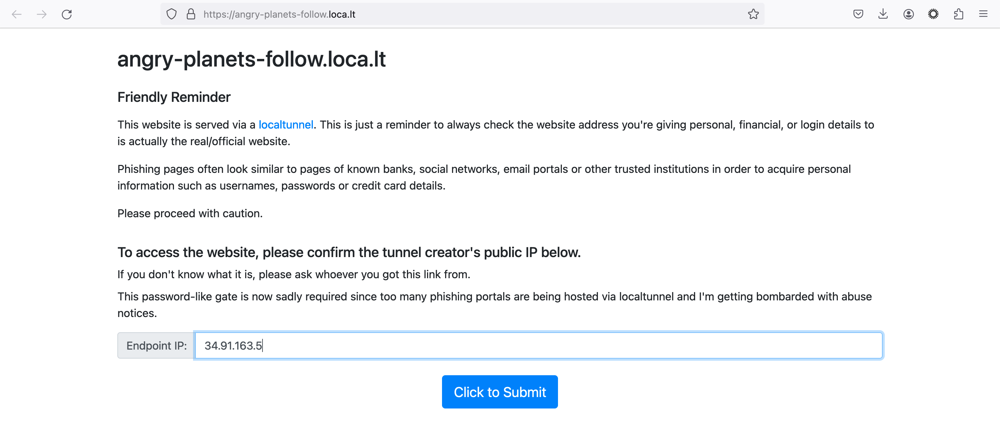
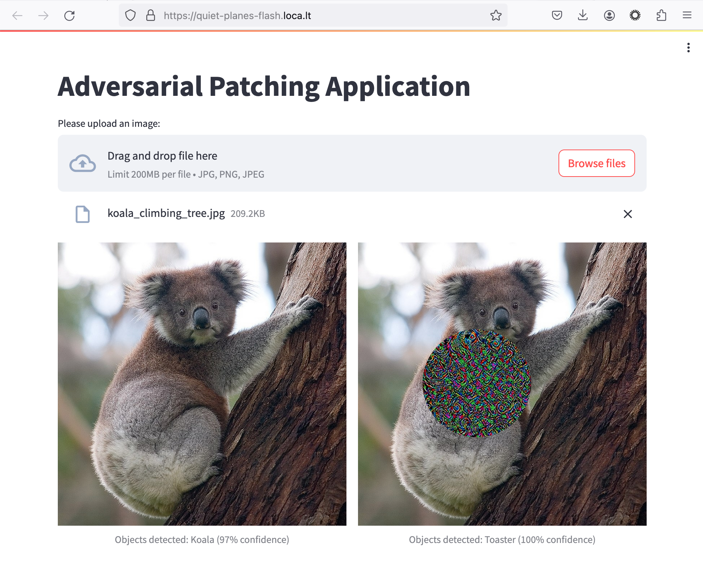

# **Software Engineering - Summative 1** 
## **December 2023/January 2024**

This repo has been created for [Software Engineering Summative 1](https://nchlondon.instructure.com/courses/3329/assignments/35561). The project was managed via the linked GitHub project. Status and label functionality within GitHub projects was used to keep track of relevant work.


&nbsp;

## 1.  **Propose a new product for your employer or a small-scale side project for your organisation**

**Project Charter**

-   **Overview** - This information technology project will focus on development of an adversarial patching application that can fool an object detection model. At upload of an image the application will generate and apply an adversarial patch that will force a misclassification of objects that appear within the patched image when it is passed to a deep learning-based convolutional neural network. 

-   **Scope** - A web application will be developed that permits image upload, adversarial patch generation, patch application and image presentation. This application will output the classification results for the unpatched and patched image. The minimum viable product is a system that demonstrably completes these goals with a small set of test images. Ensuring that this system is robust enough to handle a wide variety of image inputs is out of scope for this project. 

-   **Schedule** - This project will be completed by 19th January 2024. A hybrid project management approach will be utilised as only one person will work on the project, the outcome is to some degree predictable and work will be completed in a series of tightly time-bound sprints. In practice these sprints are the days on which I am free to work on my apprenticeship assignments during the working week.  

-   **Risks** - The principal risk stems from the inherent complexity of the task that the web app seeks to complete. The most straightforward approach will be taken, focussing on test driven development to ensure succinct and robust implementation.

-   **Stakeholders** - I am a key stakeholder as I am completing the project as part of a data science university course. The other key stakeholder is the university faculty that will review the assignment. 

**Deliverable List**

-   A GitHub repository containing a web application that permits image upload, adversarial patch generation, patch application and image presentation.

-   A zip file from which the application can be run

-   A PDF copy of this README file

**Task List & Schedule**

-   This project's tasks and schedule are managed via GitHub projects. 

**Risk Register**

-   At project outset the principal risk is that the application is more complex than appears to be required by the assessment brief and as a result will take longer to complete than expected. Despite this risk a minimum viable product will be developed and submitted as the product is of significant value to the organisation.

&nbsp;

## 2.  **Design your product using Figma or an alternative**


&nbsp;

## 3.  **Outline how you planned your project using modern planning techniques. Reflect on your planning using a project Project Management Tool** 

A hybrid methodology was selected for management of the project as it is an assignment that will be worked on over six specific working days as part of my usual working pattern. The methodology is linear in that it has a series of sequential steps, essentially those that are listed as items 1-10 on the Assessment Brief for this piece of work. On the other hand the development will be somewhat iterative; an MVP will be developed and iterated upon as far as time permits, hopefully resulting in a product that is operationally valuable within my workplace. 

The schedule and cost for this project are fixed as the schedule is determined by the university and the cost must be 0. I have selected a somewhat open scope for the project to leave open the possibility of iterative improvements. A stretch goal is to request feedback from those that might actually use an adversarial patching tool within my workplace; though the management must be linear in that a hard deadline must be met, this visibility would result in development that is more aligned with agile methodologies.

GitHub Projects has been a very effective tool for managing the tasks that need to be completed for this assignment. In addition to the 10 tasks that are detailed on the Assessment Brief, issues were created and labelled for tasks that needed to be completed once coding was underway. The ability to reorder and label these was valuable, as was the ability to add comments containing detail and the options to filter out tasks that had been completed. The titles of issues that did not represent a task that appears on the Assessment Brief were prefixed with “---” to ensure that they stood out visually. 

&nbsp;

## 4. **Capture the requirements for your project as issues or tickets shown via your chosen Project Management Tool**


&nbsp;

## 5. **Summarise how you built the minimal viable product or a prototype step by step in a written report** 

The first step towards development of a minimum viable product (MVP) for this project was to identify an adversarial patching implementation that could serve as a starting point for my work. I researched the topic and focussed on the identification of attacks on the specific architecture that is relevant to my workplace. This research led me to the Github page for Adversarial Robustness Toolbox (ART) (Trusted-AI, 2023a) and a series of example notebooks. 

I selected the notebook that best fit my requirements and imported it into Google Colab (Trusted-AI, 2023b). At runtime the notebook caused a series of errors. I edited the code to resolve these, refactored to reduce complexity and added comments and markdown that make the more complex processes easier to understand. As one of my goals is to facilitate user selection of a target class I researched and implemented fiftyone (voxel51, 2023) to facilitate the retrieval of a subset of images that appear in the dataset that was used to train the model that is "attacked" by the patching. The pre-trained model, You Only Look Once (YOLO) (Redmon et al, 2016), was trained on data from COCO (Lin et al, 2014).

My next step was to develop a test of my implementation. I identified a suitable image on the internet and wrote code to display the object detection output before and after the application of the adversarial patch. At MVP the patching represented an effective attack on the object detection model in that it caused the model to behave erratically and introduced unexpected results in the model's output. The next steps for development will focus on improving the patching so that the patch itself is classified as expected by YOLO.

&nbsp;

## 6. **Use Test Driven Development to produce an initial codebase for your product**

Test Driven Development (TDD) was used to write a function that identifies suitable images for patch training in the dataset that was retrieved from COCO via fiftyone. 

While testing the MVP an issue was identified whereby YOLO was failing to identify the target class in many of the target class-tagged images that were retrieved from COCO. This suggests that the pre-trained instance of YOLO that is implemented in this script performs poorly at identifying examples of some classes

TDD was used to define a function that iterates through the dataset that was retrieved from COCO and outputs a 4-dimensional array that represents a subset of the images that were retrieved via fiftyone in which YOLOv5 as implemented in this notebook detects only the target class. The function also returns multi-dimensional arrays representing object detections as a matching set of detections are required for adversarial patch generation. Testing was completed via ipytest. 

A test was created that defined the expected behaviour of a function named _target_class_images_and_detections_only_. This test was written as the function _test_target_class_images_and_detections_only_. The test was run to verify that it failed before coding took place to address the issue. The test was run repeatedly until it passed, asserting that the set of objects that are detected in the function's output contain the target class name only. At this point the function was refactored and tested with a different target class. This process was repeated until the code was considered to perform reliably for the task in question. 

Although it was not feasible to apply TDD to the entirety of the script in question due to its complexity and the limited time available for this assignment the value of the approach is clear, particularly in its drive towards concise modularisation of code as it is written.

&nbsp;

## 7. **Use GitHub to add features gradually**
As development progressed it became clear that it would not be possible to produce a web application that implemented the MVP code in full within the available time. The code is complex and requires a series of pip installs that are both time-consuming and likely to cause issues on local machines. For this reason development time was split across two .ipynb files:

-   Summative_1_Object_Detection_Patching_YOLO - the MVP code discussed in sections 5 and 6 above. The code implements an adversarial patching attack on a You Only Look Once (YOLO) Pytorch model.
-   Summative_1_Streamlit_Front_End - code for the generation of a web application that provides a functional prototype of the product design that appears in section 2 above. 

Github was used to manage changes to these scripts. Branches were created for feature, fix and chore-type changes as suggested by Frackson (2023); these were updated until the feature worked as desired and then merged into main. 


&nbsp;

## 8. **Document your MVP with README documentation**

As this README has been used to document completion of the Summative 1 assessment tasks this section will provide practical advice about how to run the code. 

The .ipynb files that contain the project’s codebase can be opened in Google Colab via the links below. Note that the project was developed in Google Colab and is likely to run best within the Colab environment. 

-   Summative_1_Object_Detection_Patching_YOLO.ipynb: <a target="_blank" href="https://colab.research.google.com/github/ph2139a/Summative_1/blob/main/Summative_1_Object_Detection_Patching_YOLO.ipynb">
    
-   Summative_1_Streamlit_Front_End.ipynb: <a target="_blank" href="https://colab.research.google.com/github/ph2139a/Summative_1/blob/main/Summative_1_Streamlit_Front_End.ipynb">
    

&nbsp;

**Summative_1_Object_Detection_Patching_YOLO**

This notebook requires a GPU runtime. To select a GPU runtime in Google Colab navigate to _Runtime - Change runtime type_ on the ribbon and select T4 GPU. Please note that the notebook will take approximately 10 minutes to run with the default settings. 



&nbsp;

The notebook requires an image titled “test.jpg” to be loaded into the environment’s file manager via the _Files_ section of the sidebar that appears on the left hand side of the screen. The test image that was used during development is available in this repo at https://github.com/ph2139a/Summative_1/blob/main/images/test.jpg. 


&nbsp;

The notebook is designed to be easily navigable via the _Table of contents_ section of the sidebar. 


&nbsp;

The ribbon command _Runtime - Run all_ will run the notebook’s cells in sequence. The **Model Definition** section of the code provides an option to create and attack a YOLOv5 or YOLOv3 model. Please note that YOLOv3 models caused intermittent RAM issues with Google Colab and may require further development work to implement effectively.  

&nbsp;

**Summative_1_Streamlit_Front_End**

This notebook does not require a GPU runtime. The ribbon command _Runtime - Run_ all will run the notebook’s cells in sequence and start a Streamlit application. The application applies Hayes and Danezis’ (2018) generic adversarial patch to an uploaded image. Please note that the patch that is applied to the uploaded image is obtained from a static image that is stored at https://github.com/ph2139a/Summative_1/blob/main/images/adversarial_mask.jpg. 

The URL that appears in the notebook’s final cell can be used to access the prototype application. Clicking on the URL will direct the user to a landing page for a tunnel website. Please note that this URL is generated dynamically and will be formatted as below: 

```
your url is: https://long-buses-buy.loca.lt
```

Please enter the IP Address that is generated in the notebook’s penultimate cell into the Endpoint IP box to access the application. 





&nbsp;

Please upload an image to test the application. The image that was used to produce the below screenshot is available in this repo at https://github.com/ph2139a/Summative_1/blob/main/images/koala_climbing_tree.jpg. 



Any issues with Google Colab should first be addressed by restarting the notebook via _Runtime - Disconnect_ and delete runtime and restarting via _Runtime -  Run all_. A backup dynamically-generated hyperlink for accessing the application appears in the first cell of the notebook. 

```
Your tunnel url https://outlined-probably-approaches-squad.trycloudflare.com
```

&nbsp;

## 9. **Document and use a ticketing system according to the documentation. Conventionally one ticket is one feature corresponding to one branch and one pull request**
    
This project is managed via Github Projects. This section will describe the process of using Github Projects to track the processes of creating a feature branch, update the branch and merging into the main branch. The feature that will be added to Summative_1_Streamlit_Front_End is a drop-down menu that will allow a user to select a COCO target class from a list of available classes. 

The project’s codebase has been managed via upload to Github’s UI. The first step is to download the relevant notebook via the UI:


&nbsp;

Upon implementation of the relevant code the file is uploaded and changes are committed to a new branch titled _feat-target-class-selection-dropdown_. This action creates a pull request that can be managed as a ticket within Github projects. The ticket should be assigned an appropriate status and will be marked as done automatically upon merge into main. 


&nbsp;

At review of the code I realised that it would be valuable to include a URL reference for the COCO classes as a comment within the notebook. This is added to the notebook and the update is committed to the new branch. The _feat-target-class-selection-dropdown_ branch is now 2 commits ahead of the main branch. 


&nbsp;

The branch can now be merged into main. The branch can be deleted as there is no further requirement at this time for development on the _feat-target-class-selection-dropdown branch_. Should further development be required in future the branch can be restored via the Pull Requests menu.  


&nbsp;

The application generated via the Summative_1_Streamlit_Front_End notebook has been updated to include a dropdown menu for selecting a target class. 


&nbsp;

## **References**

Frackson, J. (2023) 4 Tips for Effective Pull Request Naming. Available at: https://blog.montrealanalytics.com/4-tips-for-effective-pull-request-naming-f60793998f04 (Accessed: 05/01/20240 

Hayes, J. and Danezis, G.(2018). Learning universal adversarial perturbations with generative models. In 2018 IEEE Security and Privacy Workshops (SPW) (pp. 43-49). IEEE.

Redmon, J., Divvala, S., Girshick, R. and Farhadi, A. (2016) You only look once: Unified, real-time object detection. In Proceedings of the IEEE conference on computer vision and pattern recognition (pp. 779-788).

Trusted-AI (2023) Adversarial Robustness Toolbox. Available at: <https://github.com/Trusted-AI/adversarial-robustness-toolbox/tree/main> (Accessed: 21/12/2023)

Trusted-AI (2023) ART - Adversarial Patch - PyTorch - YOLO. Available at (<https://github.com/Trusted-AI/adversarial-robustness-toolbox/blob/main/notebooks/adversarial_patch/attack_adversarial_patch_pytorch_yolo.ipynb> (Accessed: 21/12/2023)

Lin, T.Y., Maire, M., Belongie, S., Hays, J., Perona, P., Ramanan, D., Dollár, P. and Zitnick, C.L. (2014) Microsoft coco: Common objects in context. In Computer Vision--ECCV 2014: 13th European Conference, Zurich, Switzerland, September 6-12, 2014, Proceedings, Part V 13 (pp. 740-755). Springer International Publishing.

voxel51 (2023) fiftyone. Available at: <https://github.com/voxel51/fiftyone>
   

